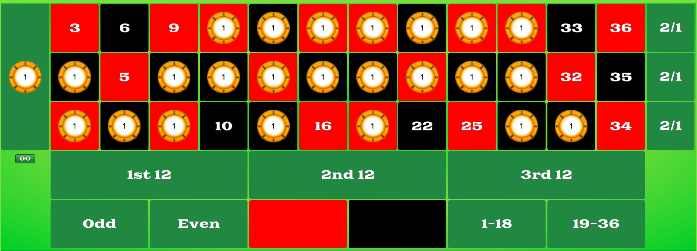

# roulette-technique-simulation

---------------------------------------------------------------------------------------------------

Avant propos : Les jeux d'argent, bien qu'ils puissent offrir des moments d'excitation et de divertissement, comportent des risques importants pour les joueurs. Ils sont conçus pour être attractifs et créer une illusion de contrôle, mais il est essentiel de se rappeler que les chances de gagner sont en faveur des opérateurs. Il n'est pas rare de voir des personnes développer une dépendance, avec des conséquences graves sur leur vie personnelle, sociale et financière. Les jeux d'argent et de hasard peuvent être dangereux : pertes d'argent, conflits familiaux, addiction… Merci de trouver conseil sur joueurs-info-service.fr (09-74-75-13-13, appel non surtaxé).

---------------------------------------------------------------------------------------------------

La semaine dernière, j'ai fais la découverte d'une technique qui permet de gagner très souvent à la roulette. Cette technique permettrait de gagner et de se faire beaucoup d'argent.
Je n'étais pas convaincu mais j'ai quand même voulu tester afin de se baser sur des données solides.
J'ai donc réalisé ce projet en python afin de réaliser quelques statistiques et analyser les données.

Voici la stratégie :
- Se procurer au moins 72 jetons.
- Miser 1 jeton sur ces 24 cases : 
En cas de scénario perdant, on peut rejouer 2 fois donc on ne peut que gagner avec cette technique.
En cas de scénario gagnant, on réalise une plus-value de 12 jetons car on en perd 24 au moment de la mise puis on en gagne 36 après avoir gagné. Il ne reste plus qu'à jouer à l'infini et récupérer le bénéfice aqcuéri tous les 12 jetons car il suffit de gagner 6 fois pour doubler sa mise, sécuriser sa position puis retirer les 72 jetons

Grâce au programme réalisé, nous allons utiliser cette technique et la comparer à d'autres pour voir si elle est vraiment efficace et s'il n'y a pas une meilleure technique.

Note : Pour ce projet, nous allons utiliser la fonction randint bien qu'elle ne génère que du "pseudo-aléatoire" cf Algorithme de Mersenne-Twister : https://fr.wikipedia.org/wiki/Mersenne_Twister