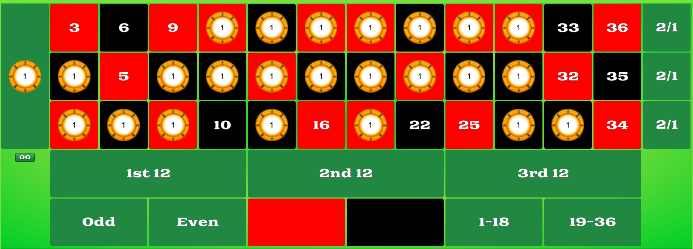
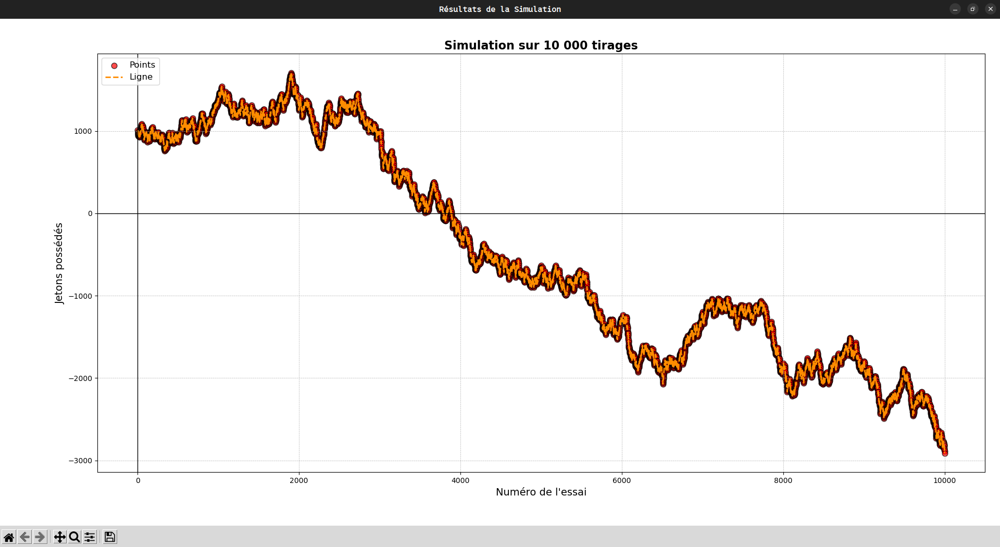

# Roulette Technique Simulation

---

## ⚠️ Avant-Propos

Les jeux d'argent peuvent offrir des moments de divertissement, mais comportent des **risques** sérieux pour les joueurs. Bien que certains puissent donner l'illusion de contrôle, les chances de gagner sont souvent en faveur des opérateurs. Il est essentiel de garder à l'esprit les dangers tels que :
- **Pertes d'argent**
- **Conflits familiaux**
- **Addiction**

Si vous avez besoin de conseils ou d'assistance, vous pouvez contacter **joueurs-info-service.fr** au **09-74-75-13-13** (appel non surtaxé).

---


## 🚀 Installation et Lancement du Programme

### Prérequis

Avant de commencer, assurez-vous d'avoir les éléments suivants installés sur votre machine :

- **Python 3**  
  [Télécharger Python](https://www.python.org/downloads/)
  
- **Pip**   
  [Guide d'installation de Pip](https://pip.pypa.io/en/stable/installation/)

### Installation des dépendances

Certaines bibliothèques Python sont nécessaires pour exécuter le programme. Vous pouvez les installer en exécutant la commande suivante dans votre terminal :

```bash
pip install -r prerequis.txt
```

### Lancer le programme

Pour exécuter le programme de simulation, suivez ces étapes :

1. **Cloner le dépôt** ou télécharger les fichiers sources :

   ```bash
   git clone https://github.com/arenmegu/roulette-technique-simulation.git
   cd roulette-technique-simulation
   ```

2. **Exécuter le script Python** :

   ```bash
   python main.py
   ```

3. **Sélectionner l'option désirée** :  
   - **Option 1** : Visualisation simple des résultats
   - **Option 2** : Visualisation graphique des résultats
   - **Option 3** : Visualisation simple et visualisation graphique
   - **Option 4** : Sortie du programme
---

## 🎯 Objectif du Projet

La semaine dernière, j'ai découvert une technique supposée permettre de gagner fréquemment à la roulette. Bien que sceptique, j'ai décidé de la tester en utilisant un programme Python pour analyser les résultats et réaliser quelques **statistiques**.

L'objectif de ce projet est d'analyser cette stratégie à travers une simulation et de déterminer si elle est réellement efficace.


### Stratégie :

1. Se procurer **1000 jetons**.
2. Miser **1 jeton par case** sur 24 cases différentes (voir schéma ci-dessous).  
   
3. En cas de victoire, on gagne **36 fois** notre mise (soit un bénéfice de 12 jetons).
4. En cas de défaite, on perd **24 jetons**.

L'idée est de simuler ce jeu avec un **nombre illimité** de jetons pour observer les résultats sur la durée.

---

## 🧑‍💻 Simulation en Python

Le programme Python développé permet de simuler des tours de roulette avec la stratégie ci-dessus, tout en tenant compte d'un concept de "ligne forte" : une croyance que les numéros de la ligne du milieu sont plus susceptibles d'être tirés.

### Algorithme Testé :

1. **Miser 24 jetons**.
2. **Tirer un nombre aléatoire**.
3. Mettre à jour un tableau contenant **37 indices** pour compter le nombre de fois que chaque numéro est tiré.
4. Si le numéro est sur la "ligne forte", on augmente un compteur spécifique.
5. Si le numéro n'est pas misé, on compte une défaite (sans retirer de jetons).
6. En cas de victoire, on ajoute **36 jetons** à notre solde.

### Résultats de Simulation (10 000 000 de tours) :

- **Victoires** : 6 486 816  
- **Défaites** : 3 513 184  
- **Pourcentage de victoires** : 64.87 %  
- **Pourcentage de défaites** : 35.13 %  
- **Probabilité de tomber sur la ligne forte** : 24.34 %

#### Distribution des Tirages pour Chaque Numéro :
| Numéro | Nombre de Tirages | Pourcentage de Chance |
|--------|-------------------|-----------------------|
| 0      | 269 396           | 2.69 %                |
| 1      | 269 647           | 2.70 %                |
| 2      | 270 213           | 2.70 %                |
| 3      | 270 147           | 2.70 %                |
| 4      | 271 785           | 2.72 %                |
| ...    | ...               | ...                   |

Les résultats montrent que la probabilité pour chaque numéro est d'environ **2.7 %**, mais il est intéressant de noter que la "ligne forte" présente un taux légèrement inférieur au taux attendu.

---

## 📉 Graphique des Résultats

Bien que les statistiques puissent sembler en faveur de la stratégie, une simulation graphique sur **10 000 essais** montre que cette stratégie n'est **pas avantageuse à long terme**. Le portefeuille de jetons montre une tendance à la décroissance progressive après un pic initial.



### Conclusion

Même si cette technique semble offrir un avantage au premier abord, sur la **longue durée**, elle se révèle inefficace. Les numéros ont tous des chances équivalentes d'être tirés, peu importe les numéros choisis. Une simulation plus poussée permettrait d'affiner ces résultats.

---

> **Note :** La fonction `randint` utilisée dans ce projet génère du "pseudo-aléatoire", basé sur l'**algorithme de Mersenne-Twister**. [En savoir plus](https://fr.wikipedia.org/wiki/Mersenne_Twister).
